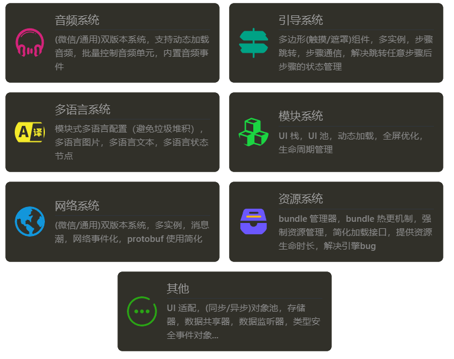

    

# Cocos Creator 3.x 游戏开发框架 (Beta)

## 📣 功能简介

> 游戏开发必备功能配齐，满足大部分游戏开发场景

    

---

## 📗 文档教程

快速入门：https://1226085293.github.io/mk-framework/quick-start/

功能模块：https://1226085293.github.io/mk-framework/module/

案例教程：https://1226085293.github.io/mk-framework/tutorial/

API 接口：https://1226085293.github.io/mk-framework/api/

AI 助手（GPT3.5/免费）：[MKFrameworkAI](https://poe.com/MKFrameworkAI)

AI 助手（GPT4/需订阅）：[MKFrameworkAI-GPT4](https://poe.com/MKFrameworkAI-GPT4)

## 🛠️ 安装框架

### 依赖环境
- NodeJs

### NPM 方式
1. 打开终端

1. 执行 `npm i -g @muzzik/mk-install`，等待安装完成
1. 执行 `npx mk-install`
1. 输入你的项目路径回车
1. 输入 `install` 回车，等待安装完成

## 😀 仓库说明

> 本仓库为 MKFramework 的示例项目，如果对框架模块有疑惑可参考此项目代码使用，如果示例不存在请联系开发人员补充

### 项目初始化

1. 控制台执行 `npm i`

## 📭 联系方式

- QQ 群：200351945

- 微信：_muzzik
