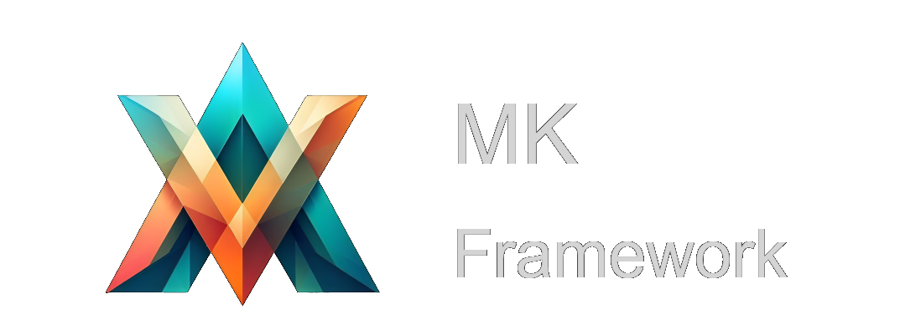

    

# Cocos Creator 3.x 游戏开发框架 (Beta)

## 📣 功能简介

> 游戏开发必备功能配齐，满足大部分游戏开发场景

    

---

## 🛠️ 安装框架

https://github.com/1226085293/MKFramework/wiki/%E5%AE%89%E8%A3%85%E6%A1%86%E6%9E%B6

## 📗 文档教程

https://github.com/1226085293/MKFramework/wiki

## 😀 仓库说明

> 本仓库为 MKFramework 的示例项目，如果对框架模块有疑惑可参考此项目代码使用，如果示例不存在请联系开发人员补充

### 项目初始化

1. 控制台执行 `npm i`

## 📭 联系方式

- QQ 群：200351945

- 微信：_muzzik
